# LARGA Data Model (ERD)

This documents the Firestore data model actually implemented in [LARGA.Shared.Models/Entities](../LARGA.Shared.Models/Entities) and written to by [LARGA.SharedCore/Services](../LARGA.SharedCore/Services) and the mobile/web apps.

It reflects the original capstone ERD **plus three tables that exist in code and in the live Firestore database but were missing from the original diagram**: `CHAT_MESSAGE`, `SHIFT_SCHEDULE`, and `SYSTEM_CONFIG`. Every table maps 1:1 to a Firestore collection of the same name in lowercase/snake_case (e.g. `USER` → `users`, `SHIFT_LOG` → `shifts`, `MAINTENANCE_RECORD` → `maintenance_logs`).

```mermaid
erDiagram
    USER ||--o{ AUDIT_LOG : "performs"
    USER ||--o{ SHIFT_LOG : "drives (DriverID)"
    USER ||--o{ MAINTENANCE_RECORD : "logs (ManagerID)"
    USER ||--o{ CHAT_MESSAGE : "sends/receives"
    USER ||--o{ SHIFT_SCHEDULE : "is scheduled for"
    USER ||--o{ DEBT_ADJUSTMENT : "accrues"
    USER ||--o{ SYSTEM_ALERT : "is subject of"

    TAXI_UNIT ||--o{ SHIFT_LOG : "used in"
    TAXI_UNIT ||--o{ MAINTENANCE_RECORD : "serviced in"
    TAXI_UNIT ||--o{ SHIFT_SCHEDULE : "is scheduled for"

    SHIFT_LOG ||--o{ BOUNDARY_PAYMENT_LEDGER : "settles"
    SHIFT_LOG ||--o{ HANDOVER_CHECKLIST : "records"
    SHIFT_LOG ||--o{ GPS_TELEMETRY : "tracks"
    SHIFT_LOG ||--o{ EMERGENCY_ALERT : "raises"
    SHIFT_LOG ||--o{ FUEL_LOG : "refuels"
    SHIFT_LOG |o--o{ MAINTENANCE_RECORD : "may trigger"

    MAINTENANCE_RECORD ||--o{ MAINTENANCE_PARTS_USED : "consumes"
    SPARE_PARTS ||--o{ MAINTENANCE_PARTS_USED : "used in"
    TAXI_UNIT ||--o{ ROUTINE_CHECK : "has upcoming"
    USER ||--o{ MAINTENANCE_RECORD : "reports (ReportedByDriverID)"

    USER {
        string UserID PK
        string FullName
        string Email
        string PhoneNumber "VARCHAR(12)"
        enum Role "'Driver','Manager'"
        int PerformanceScore
        decimal CurrentArrears "DECIMAL(10,2)"
        string LicenseNumber "CHAR(11)"
        date LicenseExpiryDate
        enum LicenseClassification "'Professional','Non-Professional'"
        string LicenseRestrictionCode "VARCHAR(2)"
        string Address "added 2026-09-07, Driver & Shift Management"
        date DateJoined "added 2026-09-07"
        string LtoIdPhotoUrl "added 2026-09-07; field only - no upload UI yet"
        string ManagerNote "added 2026-09-07; written by ManagerWeb, not yet displayed by LARGA.MobileApp"
        bool MustChangePassword "added 2026-09-07; not yet enforced by LARGA.MobileApp"
    }

    AUDIT_LOG {
        string AuditLogID PK
        string UserID FK
        string ActionType "VARCHAR(100)"
        text AuditLogDetails
        string IPAddress "VARCHAR(45)"
        timestamp Timestamp
    }

    TAXI_UNIT {
        string TaxiID PK
        string Model
        string PlateNumber "VARCHAR(15)"
        int YearManufactured
        int CurrentMileage
        enum Status "'On Standby','Active Unit','Under Maintenance','Decommissioned'"
        date LastServicedDate
    }

    SHIFT_LOG {
        string ShiftID PK
        string DriverID FK
        string TaxiID FK
        timestamp ShiftStart
        timestamp ShiftEnd "nullable"
        enum Status "'Active','Completed','Overdue'"
        int StartMileage
        int EndMileage "nullable"
        boolean IsOnBreak "driver-toggled mid-shift"
        text ManagerNote
    }

    BOUNDARY_PAYMENT_LEDGER {
        string PaymentID PK
        string ShiftID FK
        decimal ExpectedBoundary "DECIMAL(10,2)"
        decimal LateFees "DECIMAL(10,2)"
        decimal AmountPaid "DECIMAL(10,2)"
        enum PaymentMethod "'Cash','E-Wallet'"
        enum PaymentStatus "'Paid','Partial','Unpaid'"
        int ReferenceNumber
        string EPayReceiptPhoto "URL"
        timestamp Timestamp
    }

    DEBT_ADJUSTMENT {
        string AdjustmentID PK
        string DriverID FK
        decimal Amount "DECIMAL(10,2), positive adds to debt, negative is a credit/write-off"
        string Reason
        timestamp Timestamp
    }

    HANDOVER_CHECKLIST {
        string ChecklistID PK
        string ShiftID FK
        enum ChecklistType "'Pre-Shift','End-Shift'"
        boolean TireCondition
        boolean OilLevel
        boolean CoolantLevel
        boolean InteriorCleanliness
        boolean ExteriorScratches
        enum FuelVerification "'Half-tank','Below half-tank'"
        string ScratchesPhotoURL "URL"
        string FuelDashboardURL "URL"
        timestamp Timestamp
    }

    GPS_TELEMETRY {
        string LogID PK
        string ShiftID FK
        decimal Latitude "DECIMAL(9,6)"
        decimal Longitude "DECIMAL(9,6)"
        int Speed
        timestamp Timestamp
    }

    EMERGENCY_ALERT {
        string AlertID PK
        string ShiftID FK
        decimal Latitude "DECIMAL(9,6)"
        decimal Longitude "DECIMAL(9,6)"
        boolean IsResolved
        timestamp Timestamp
    }

    FUEL_LOG {
        string FuelID PK
        string ShiftID FK
        string FuelStation "VARCHAR(50)"
        decimal LitersRefueled "DECIMAL(5,2)"
        decimal FuelCost "DECIMAL(10,2)"
        string ORNumber "VARCHAR(50)"
        string ReceiptImageURL "URL"
        timestamp ReceiptTimestamp
        enum VerificationStatus "'Pending','Verified','Flagged'"
        text FuelLogDetails
        int OdometerReading
        string OdometerPhotoURL "URL"
    }

    MAINTENANCE_RECORD {
        string MaintenanceID PK
        string TaxiID FK
        string ManagerID FK
        string ShiftID FK "nullable"
        enum MaintenanceType "'Routine Checkup','Breakdown Repair','Accident Correction'"
        string IssueTitle "VARCHAR(100)"
        text IssueDescription
        date DateLogged
        date DateResolved "nullable"
        decimal LaborCost "DECIMAL(10,2)"
        decimal TotalCost "DECIMAL(10,2)"
        string SupportingPhotoURL "URL"
        enum PriorityLevel "'Low','Medium','High'"
        string ReportedByDriverID FK "nullable - added 2026-09-10"
        string Status "'Reported','InProgress','Resolved','Dismissed' - added 2026-09-10"
        text MechanicInstructions "nullable - added 2026-09-10"
        date EstimatedCompletionDate "nullable - added 2026-09-10"
    }

    ROUTINE_CHECK {
        string CheckID PK
        string TaxiID FK
        string CheckName "VARCHAR(100)"
        int DueMileage "nullable - absolute odometer target"
        date DueDate "nullable - for a date-based check instead of a mileage-based one"
    }

    MAINTENANCE_PARTS_USED {
        string UsageID PK
        string MaintenanceID FK
        string PartID FK
        int QuantityUsed
    }

    SPARE_PARTS {
        string PartID PK
        string PartName "VARCHAR(100)"
        int StockQuantity
        int ReorderLevel
        decimal UnitPrice "DECIMAL(10,2)"
    }

    CHAT_MESSAGE {
        string MessageID PK
        string DriverID FK "parent path: chats/{DriverID}/messages"
        text Text
        boolean IsDriver "true = sent by driver, false = sent by manager"
        timestamp Timestamp
    }

    SHIFT_SCHEDULE {
        string ScheduleID PK
        string DriverID FK
        string TaxiID FK
        timestamp ScheduledStartTime
        string Status "default 'Planned'"
    }

    SYSTEM_CONFIG {
        string ConfigID PK
        decimal StandardLatePenalty "DECIMAL(10,2)"
        decimal DefaultBoundaryRate "DECIMAL(10,2)"
        decimal IdleThresholdMinutes "minutes of no movement before a unit is flagged Idle; default 15"
    }

    SYSTEM_ALERT {
        string AlertID PK
        string Type "'DriverIdle' for now"
        string DriverID FK
        string DriverName "denormalized"
        string TaxiID FK
        string UnitLabel "denormalized, e.g. 'Unit 04'"
        string ShiftID FK
        string Message
        timestamp Timestamp
        bool IsRead "default false"
    }
```

## Live fleet status (computed, not stored)

The ManagerWeb dashboard's 5 fleet-status pills (Active / Maintenance / On Break / SOS / Idle) are **not** the same thing as `TAXI_UNIT.Status` above — they're a live, computed value evaluated per taxi at read time by [FleetReportingService](../LARGA.SharedCore/Services/FleetReportingService.cs), in this precedence (first match wins, so every taxi always gets exactly one label):

1. **SOS** — an unresolved `EMERGENCY_ALERT` tied to the taxi's current/most recent shift.
2. **Maintenance** — `TAXI_UNIT.Status == "Under Maintenance"`.
3. **On Break** — taxi has a `SHIFT_LOG` with `Status == "Active"` and `IsOnBreak == true`.
4. **Active** — taxi has a `SHIFT_LOG` with `Status == "Active"`, not on break, and its latest `GPS_TELEMETRY` point is newer than `now - SYSTEM_CONFIG.IdleThresholdMinutes` with `Speed > 0`.
5. **Idle** — everything else (default/fallback): on an active shift but stale or zero-speed telemetry, or simply no active shift right now and not under maintenance.

## Dashboard read-cost notes

`SHIFT_LOG` and `BOUNDARY_PAYMENT` are written roughly once per taxi per day, so their total row count grows without bound the longer the fleet actually operates - unlike `TAXI_UNIT`/`USER` (bounded by fleet/team size) or `MAINTENANCE_RECORD`/`EMERGENCY_ALERT` (incident-driven, far lower volume). [FleetReportingService](../LARGA.SharedCore/Services/FleetReportingService.cs) queries the first two narrowly (`status == "Active"`, or `shiftStart`/`timestamp` within the last 14 days) instead of fetching either collection in full, so a dashboard load stays cheap regardless of how many months/years of history have accumulated. One consequence: **Top Driver Standings reports the last 14 days, not all-time** - a deliberate tradeoff of this design, not a bug.

## Notes / known gaps vs. this diagram (as of 2026-09-05)

- **`AUDIT_LOG`**: modeled since early on, but had no reader anywhere until the ManagerWeb "Generate Reports" CSV export (Full Audit Trail) landed on 2026-09-06 — first real consumer.
- **`HANDOVER_CHECKLIST`**: same situation until the Driver & Shift Management page's Shift Logs checklist modal landed on 2026-09-07 - first real consumer. Note the modal doesn't show a 1:1 mapping of every mockup checklist item: `OilLevel`/`CoolantLevel` are combined into a single "under the hood" row, and "starting odometer documented" is omitted entirely since no field anywhere backs it (odometer readings live on `FUEL_LOG`, not `HANDOVER_CHECKLIST`).
- **`SHIFT_LOG`**: nothing in the *mobile* app currently calls the code path that creates a shift document (`StartShiftLogAsync` in [ShiftManagementService.cs](../LARGA.SharedCore/Services/ShiftManagementService.cs) has no callers yet), so shifts aren't persisted from the pre-shift flow yet. ManagerWeb only ever reads this collection, never creates shifts.
- **`SHIFT_SCHEDULE`**: as of 2026-09-07, ManagerWeb's Schedule Planner reads and writes this collection interactively. Document IDs are deterministic (`{driverId}_{yyyyMMdd}`) so a manager's edit always overwrites/deletes the same document rather than creating duplicates. As of 2026-09-16 (see below), the meaning of "no document" flipped from rest day to working day - a document now only exists to record an exception (`Status = "DayOff"`, or `Status = "Planned"` for a per-day unit-swap override).
- **Driver accounts are manager-provisioned, not self-registered**: drivers never sign up themselves anywhere (mobile has no registration flow) - a manager creates every driver's Firebase Auth account and Firestore profile via ManagerWeb's "Add New Driver" (ManagerWeb requires the `FirebaseAdmin` SDK for this, alongside the existing `Google.Cloud.Firestore` client). The login email is synthesized (`{name-slug}.{random}@larga-driver.local`) since the "Add New Driver" form only collects name/phone/temp password - the manager relays the generated email + password to the driver directly, out of band.
- `USER` also carries `AssignedTaxiID` and `DeviceTokens` (push notification tokens) in code/Firestore, which are implementation details not modeled as columns here since they don't have their own business meaning in the ERD sense.
- **`TAXI_UNIT.PlateNumber`** was live in Firestore but missing from both the ERD and the C# model until 2026-09-05 — added to [TaxiUnit.cs](../LARGA.Shared.Models/Entities/TaxiUnit.cs) and to this diagram.
- **`FUEL_LOG`**: `FuelStation`, `ORNumber`, and `ReceiptTimestamp` were also missing from [FuelLog.cs](../LARGA.Shared.Models/Entities/FuelLog.cs) until 2026-09-05 — added and now match the diagram above.
- Known live-data bugs found and corrected via the seed tool (see [LARGA.SeedTool](../LARGA.SeedTool)): a `maintenance_logs` document had `supportingPhotoURL` (wrong casing, code expects `supportingPhotoUrl`) and a `boundary_payments` document had `amountPaid` stored as a string instead of a number.
- **Fields written but not yet read anywhere on mobile**: `USER.ManagerNote` (meant to show on the driver's mobile home screen) and `USER.MustChangePassword` (meant to force a password change after a manager-set temporary password) are both written by ManagerWeb as of 2026-09-07, but `LARGA.MobileApp` doesn't display or enforce either yet - that's separate, future mobile-side work.
- **Computed, not stored**: Driver Profile's Punctuality %, Payment Reliability %, and Damage Incidents are all computed on read from `SHIFT_LOG`/`BOUNDARY_PAYMENT`/`MAINTENANCE_RECORD` history - there's no corresponding stored field for any of them.
- **`DEBT_ADJUSTMENT`**: new as of 2026-09-10, backing the Financial Ledger & Debts page's "+ Adjustment" modal (see [FinancialLedgerService](../LARGA.SharedCore/Services/FinancialLedgerService.cs)). Deliberately its own collection (`debt_adjustments`) rather than a synthetic `BOUNDARY_PAYMENT_LEDGER` row, since an adjustment isn't money a driver actually handed over.
- **Financial Ledger & Debts page (2026-09-10)**: the "Daily Settlements (Today)" tab lists every `SHIFT_LOG` whose `ShiftStart` falls on the current UTC day (active or already ended), joined to its `BOUNDARY_PAYMENT_LEDGER` row when one exists. A shift with no payment doc yet (including one still "on road") is shown as *Waiting* with the row's expected boundary defaulted from `SYSTEM_CONFIG.DefaultBoundaryRate`, rather than pre-creating a payment document - the document is only created on the manager's first "Record Payment" click, with a deterministic ID (`{shiftId}_PAY`, matching the seed data's own convention) so a later "Add Payment" on the same shift updates that same document instead of creating a duplicate.
- **Master Debt Ledger tab (2026-09-10)**: an all-time reckoning of each driver's outstanding debt, so - unlike everywhere else in this service - it fetches `SHIFT_LOG` and `BOUNDARY_PAYMENT_LEDGER` in full rather than windowed (see "Dashboard read-cost notes" above for why those two normally stay narrow; windowing would defeat a feature whose whole point is all-time visibility). A driver's debt = sum of (Expected + LateFees − AmountPaid) across their non-Paid `BOUNDARY_PAYMENT_LEDGER` rows, plus their net `DEBT_ADJUSTMENT` total, floored at 0. Same lazy-payment-doc limitation as Daily Settlements: a shift nobody ever attempted to pay (no document at all) isn't visible to this either. "Settle" applies a lump sum oldest-debt-first across a driver's outstanding boundary payments, then any leftover as an automatic offsetting credit against their adjustment total; an overpayment beyond total debt is reported back rather than recorded as a negative balance. "History" reconstructs a running-debt column by replaying a driver's `BOUNDARY_PAYMENT_LEDGER` rows (one per shift, its *current* state - not a payment-by-payment log, since `RecordPaymentAsync`/`SettleDebtAsync` update the same document in place) and `DEBT_ADJUSTMENT` rows (append-only, so these do have real history) in chronological order - it isn't stored anywhere.
- **Garage / Maintenance Scheduler page (2026-09-10)**: `MAINTENANCE_RECORD.Status` (new field) drives the page's 3 sections - `"Reported"` = a driver-filed defect report with no work order yet ("Pending Driver Reports"); `"InProgress"` = a ticket has been created and it's an active work order currently in the shop ("Active Work Orders" - the "Day N" badge is computed from `DateLogged`, not stored); `"Resolved"`/`"Dismissed"` both go to the History modal, distinguished by status since `DateResolved` alone can't express "dismissed without ever being worked on." "Create Ticket" sets `Status="InProgress"` plus `MechanicInstructions`/`EstimatedCompletionDate`; "Schedule" on a `ROUTINE_CHECK` skips the driver-report stage entirely (it's manager/system-initiated, not driver-flagged) - it prompts for a date (Automatic or Manual), then creates a `MAINTENANCE_RECORD` directly as `"InProgress"` (that date becomes its `EstimatedCompletionDate`) and deletes the `ROUTINE_CHECK` document, rather than round-tripping through "Reported" first. Automatic mode (`GetNextAvailableScheduleDateAsync`) never picks today - it starts at tomorrow and, for each candidate day, counts existing `"InProgress"` rows sharing that `EstimatedCompletionDate`; at 2 or more (the shop's daily capacity, hardcoded) it tries the next day, repeating until one is under capacity. Manual mode isn't capacity-checked - only Automatic enforces it. `GetGarageSnapshotAsync` fetches `maintenance_logs` in full, same reasoning as `FleetReportingService`'s dashboard reads: it's incident-driven, not written once-per-taxi-per-day, so its volume grows far slower than `shifts`/`boundary_payments`. "Due in X km" on a `ROUTINE_CHECK` is `DueMileage − current odometer`, where current odometer is read from each taxi's most recent `SHIFT_LOG` in the last 30 days (`EndMileage` if that shift has ended, else its `StartMileage`) rather than the static `TAXI_UNIT.CurrentMileage` field, which nothing keeps in sync automatically - a taxi with no shifts in that window falls back to `CurrentMileage`. The 30-day window is queried with `WhereGreaterThanOrEqualTo` on `shiftStart` alone (auto-indexed) rather than `WhereEqualTo(taxiId)` + `OrderBy(shiftStart)` per taxi, which would need a manually-created composite index.
- **Mobile evidence photos now upload to Firebase Cloud Storage (2026-09-14)**: [PhotoStorageService](../LARGA.SharedCore/Services/PhotoStorageService.cs) wraps `Plugin.Firebase.Storage`'s client SDK (`CrossFirebaseStorage` - authenticates as the signed-in driver, subject to Storage Security Rules, not the admin SDK ManagerWeb/SeedTool use) with one method: upload bytes, return the download URL or `null` on failure. Wired into the three places mobile captures a photo: `PreShiftStep2ViewModel`/`EndShiftStep2ViewModel`'s fuel-level photo (`fuel_photos/{driverId}/{preshift|endshift}_{timestamp}.jpg`) and `OdometerScanPage`'s odometer-dashboard photo, uploaded only for the one frame the driver actually taps to confirm (`odometer_photos/{driverId}/{timestamp}.jpg`), then relayed back to whichever step-2 page opened the scanner via the same `Shell.GoToAsync` query-parameter dictionary already carrying the recognized number, into new `FuelPhotoUrl`/`OdometerPhotoUrl` view-model properties. A failed upload returns `null` rather than throwing/blocking the flow - these properties aren't part of `CanStartShift`/`IsComplete`, only the local in-memory preview is. **These URLs aren't persisted anywhere yet**: like `SHIFT_LOG`/`FUEL_LOG` creation itself (see above), nothing on mobile writes a shift or fuel-log document at all right now, so there's currently no Firestore field these URLs end up in - they're sitting on the view models ready for whenever that write pipeline gets built. Also out of scope here: `MAINTENANCE_RECORD.SupportingPhotoUrl` (the defect-report photo) isn't wired, since the defect-report page itself (`vehicle-defect-page`) doesn't exist yet - see `ReportDefectCommand` in `PreShiftStep1ViewModel`/`EndShiftStep1ViewModel`. Also needs its own Storage Security Rules (a separate rule set from Firestore's, configured in the same Firebase Console) before any of these uploads will actually succeed against a real project - not yet written/reviewed as part of this change.
- **`SYSTEM_ALERT` / idle-driver alerts + notification bell (2026-09-15)**: `SYSTEM_CONFIG.IdleThresholdMinutes` changed from 10 to 15. New `system_alerts` collection (`SystemAlert.cs`) for system-*generated* notices, distinct from driver-initiated `EMERGENCY_ALERT` (SOS) and `MAINTENANCE_RECORD` (defect reports). [IdleAlertMonitorService](../LARGA.ManagerWeb/Services/IdleAlertMonitorService.cs) is a `BackgroundService` inside the ManagerWeb process (there's no separate worker/cron infra in this project) that polls every 3 minutes via `FleetReportingService.GetIdleDriversAsync()` - which mirrors the live fleet-status precedence (skips a taxi that's under maintenance, on break, or has an unresolved SOS, so only a genuinely-idle active shift qualifies) - and writes one alert per idle episode via a deterministic doc ID (`{shiftId}_IDLE`), making repeated polling ticks idempotent; a driver who moves and goes idle again *within the same shift* won't get a second alert. [AlertService](../LARGA.SharedCore/Services/AlertService.cs) is ManagerWeb's admin-SDK reader/writer (recent alerts + mark-read) backing the new `NotificationBell` component that replaced the old placeholder "Notifications" icon-button in all 4 page headers (Dashboard/Driver & Shifts/Financial Ledger/Garage) - polls every 60s while mounted. Mobile's `AlertCenterViewModel` separately reads unread `DriverIdle` alerts directly from `system_alerts` via the client SDK (single `WhereEqualsTo("type", "DriverIdle")` filter - `isRead` filtering and timestamp ordering done client-side to stay index-free) and renders them as a 4th card type (`DriverIdleTemplate`) alongside the existing mock SOS/Fuel/ShiftApproval cards; dismissing a real alert marks it read in Firestore so it doesn't reappear, while dismissing a mock card is still purely local. **Needs a Firestore rule added** (not in this diff, rules aren't tracked in this repo - see `firestore.rules` in Firebase Console): managers need `read` on `system_alerts` and `update` limited to the `isRead` field; no client `create` rule is needed since alerts are only ever written server-side by `IdleAlertMonitorService`. **Not seeded**: none of `LARGA.SeedTool`'s 5 demo taxis represent the specific "active shift, stale telemetry" state this alert fires on (the existing Idle demo taxi, `TAXI_005`, has no active shift at all, which doesn't qualify) - the feature has nothing to show until a real idle episode occurs or dedicated seed data is added.
- **License eligibility (2026-09-15)**: `DriverManagementService.ComputeLicenseStatus`'s "Expiring" window changed from 30 days to 3 calendar months (Expired/Valid thresholds unchanged: past-due and beyond-3-months respectively). New `IsEligibleForShift` check: a driver whose license expires within 1 month (or has already expired) is never reported as "On Shift" by `GetRosterSnapshotAsync`/`GetDriverProfileAsync`, even if they have a real `SHIFT_LOG` with `Status == "Active"` - same "computed, not stored" pattern as `LicenseStatus`/live fleet status elsewhere in this codebase. This does **not** end or modify the underlying shift document; it only overrides what the Driver & Shift Management roster/profile *reports*. Shift Logs still shows the real shift as-is.
- **Philippine-time display + PH-calendar-day settlements (2026-09-15)**: new `PhilippineTime` (`LARGA.SharedCore`) - a fixed UTC+8 offset (the Philippines has no daylight saving, so no `TimeZoneInfo` lookup is needed, which would also require different zone-ID strings on Windows vs. Linux). `PhilippineTime.Now`/`.ToPhilippineTime()` are used everywhere a manager-facing timestamp is *displayed* (Dashboard's header date, Financial Ledger's shift-end/payment/transaction times and CSV exports, Garage's report/history dates, Driver & Shift Management's shift-log "Today"/"Yesterday" labels, `FleetReportingService`'s 4 CSV-export builders) - Firestore itself stays UTC throughout, only the rendering changed. Separately, `FinancialLedgerService.GetDailySettlementAsync`'s "today" window now truncates to the *Philippine* calendar day before converting back to UTC query bounds, fixing a real bug: the old `dateUtc.Date` truncation was up to 8 hours off from the actual PH business day, so a shift starting in the early-morning PH hours could be silently excluded from "Daily Settlements (Today)" for part of the day. **Deliberately not touched** (same UTC-`.Date` bug class, flagged for a separate pass): Schedule Planner's `IsToday`/`GetWeekScheduleAsync`/`StartOfWeek` week-grid boundaries (touching this risks the `ScheduleDocId` `{driverId}_{yyyyMMdd}` convention against already-seeded data), `GarageService.GetNextAvailableScheduleDateAsync`'s "tomorrow" boundary, and `FleetReportingService`'s rolling 7/14-day dashboard windows (lowest severity - multi-day windows are barely affected by an 8-hour skew).
- **Checklist comparison + previous inspection/damage history (2026-09-15)**: the Driver & Shift Management checklist modal no longer tab-switches between Pre-Shift and Post-Shift (only one visible at a time) - both now render side by side via the new `ChecklistPanel` component so a manager can compare them directly, still genuinely separate `HANDOVER_CHECKLIST` documents as before. `GetShiftChecklistsAsync` also now returns the taxi unit's last few past checklists (`PreviousChecklists`, from other shifts on the same `TaxiID`) and its accident/damage maintenance history (`DamageHistory`, `MAINTENANCE_RECORD` rows with `MaintenanceType == "Accident Correction"`), shown in a "Previous Inspection & Damage History" section below the two panels - both single-equality-filtered on `taxiId`/`shiftId` (no composite index), same index-avoidance pattern used elsewhere.
- **Schedule Planner Board View (2026-09-15)**: the Schedule Planner tab briefly offered a "Board View" alongside the existing "Table View" - same `WeekSchedule` data, re-grouped by day instead of by driver. **Superseded the next day** (see below) by the default-to-working redesign, which removed the view toggle entirely; Board View no longer exists.
- **Schedule Planner defaults to working, not "pick every day" (2026-09-16)**: replaced the "assign every working day" model (and its Table View/Board View toggle) with a single grid where every cell defaults to the driver working their permanently assigned unit (`USER.AssignedTaxiID`), and a manager only has to touch the one exception that matters - a day off - mirroring how BLM Taxi's boundary system actually works (one driver, one unit, permanently assigned; drivers work daily by default, days off are the exception, not the norm). Driven by the capstone adviser's explicit note that assigning every day for every driver shouldn't be a manual hassle. `DriverScheduleRow.DefaultTaxiId` carries the driver's permanent unit; `ScheduleDayCell.IsDayOff` distinguishes the two effective states (working-default, day-off) that `GetWeekScheduleAsync` computes by overlaying that week's `SHIFT_SCHEDULE` day-off documents onto each driver's default. Clicking a cell is a direct one-step toggle (`ToggleDayOffAsync` in `DriverShifts.razor`) between those two states - no dropdown, no per-day unit reassignment. New `MarkDayOffAsync` writes the day-off exception; `ClearScheduleAsync` means "remove the day-off exception, reverting to the default working day" (previously "clear to a rest day") - same method, inverted meaning, so double-check any other future caller if one is ever added. **Initially shipped with a per-day unit-swap option** (a dropdown to cover a driver's unit with a different one for a single day) but removed the same day once it came out that BLM Taxi's actual policy is one driver = one unit, permanently, until resignation - there is no covering-unit concept, so `AssignScheduleAsync`/`ScheduleDayCell.IsSwapped` were deleted rather than left as unused code. A driver with no `AssignedTaxiID` set shows a "NO UNIT" warning state instead of silently defaulting to nothing.
- **Financial Ledger totals + date-only Payment History (2026-09-15)**: both Financial Ledger tables now end in a totals row - Daily Settlements sums Boundary/Paid/Balance (reusing `DailySettlementSnapshot`'s existing `ExpectedCollection`/`CollectedSoFar`/`StillOutstanding`, so the row can't drift from the summary cards above it), Master Debt Ledger sums Debt (reusing `TotalOutstandingDebt`). The "Financial History" modal's transaction table/CSV export (a driver's payment history) now shows date only, no time.
- **Driver-side license expiry alert + maintenance day count (2026-09-15)**: `DriverDashboardViewModel` (mobile) now reads the signed-in driver's own `licenseExpiryDate` and shows a License Alert card using the same thresholds as `DriverManagementService.ComputeLicenseStatus` (Expired past-due, Expiring within 3 months) - computed client-side, nothing new stored. When the driver's assigned taxi is `"Under Maintenance"`, it also queries `maintenance_logs` (single equality filter on `taxiId`, `status == "InProgress"` filtered client-side) and shows "Day X of Y" under the Maintenance Status pill, mirroring `WorkOrderEntry.DayNumber`'s `DateLogged`-based computation on the ManagerWeb side, with Y derived from `EstimatedCompletionDate` when the manager set one.
- **Naming consistency (2026-09-15)**: the sidebar nav label changed from "Fin. Ledger" to "Financial Ledger" - every other reference in the app (page title, service doc comments) already used the full name; this was the one holdout.
