# LARGA Data Model (ERD)

This documents the Firestore data model actually implemented in [LARGA.Shared.Models/Entities](../LARGA.Shared.Models/Entities) and written to by [LARGA.SharedCore/Services](../LARGA.SharedCore/Services) and the mobile/web apps.

It reflects the original capstone ERD **plus three tables that exist in code and in the live Firestore database but were missing from the original diagram**: `CHAT_MESSAGE`, `SHIFT_SCHEDULE`, and `SYSTEM_CONFIG`. Every table maps 1:1 to a Firestore collection of the same name in lowercase/snake_case (e.g. `USER` → `users`, `SHIFT_LOG` → `shifts`, `MAINTENANCE_RECORD` → `maintenance_logs`).

```mermaid
erDiagram
    USER ||--o{ AUDIT_LOG : "performs"
    USER ||--o{ SHIFT_LOG : "drives (DriverID)"
    USER ||--o{ MAINTENANCE_RECORD : "logs (ManagerID)"
    USER ||--o{ CHAT_MESSAGE : "sends/receives"
    USER ||--o{ SHIFT_SCHEDULE : "is scheduled for"

    TAXI_UNIT ||--o{ SHIFT_LOG : "used in"
    TAXI_UNIT ||--o{ MAINTENANCE_RECORD : "serviced in"
    TAXI_UNIT ||--o{ SHIFT_SCHEDULE : "is scheduled for"

    SHIFT_LOG ||--o{ BOUNDARY_PAYMENT_LEDGER : "settles"
    SHIFT_LOG ||--o{ HANDOVER_CHECKLIST : "records"
    SHIFT_LOG ||--o{ GPS_TELEMETRY : "tracks"
    SHIFT_LOG ||--o{ EMERGENCY_ALERT : "raises"
    SHIFT_LOG ||--o{ FUEL_LOG : "refuels"
    SHIFT_LOG |o--o{ MAINTENANCE_RECORD : "may trigger"

    MAINTENANCE_RECORD ||--o{ MAINTENANCE_PARTS_USED : "consumes"
    SPARE_PARTS ||--o{ MAINTENANCE_PARTS_USED : "used in"

    USER {
        string UserID PK
        string FullName
        string Email
        string PhoneNumber "VARCHAR(12)"
        enum Role "'Driver','Manager'"
        int PerformanceScore
        decimal CurrentArrears "DECIMAL(10,2)"
        string LicenseNumber "CHAR(11)"
        date LicenseExpiryDate
        enum LicenseClassification "'Professional','Non-Professional'"
        string LicenseRestrictionCode "VARCHAR(2)"
    }

    AUDIT_LOG {
        string AuditLogID PK
        string UserID FK
        string ActionType "VARCHAR(100)"
        text AuditLogDetails
        string IPAddress "VARCHAR(45)"
        timestamp Timestamp
    }

    TAXI_UNIT {
        string TaxiID PK
        string Model
        string PlateNumber "VARCHAR(15)"
        int YearManufactured
        int CurrentMileage
        enum Status "'On Standby','Active Unit','Under Maintenance','Decommissioned'"
        date LastServicedDate
    }

    SHIFT_LOG {
        string ShiftID PK
        string DriverID FK
        string TaxiID FK
        timestamp ShiftStart
        timestamp ShiftEnd "nullable"
        enum Status "'Active','Completed','Overdue'"
        int StartMileage
        int EndMileage "nullable"
        boolean IsOnBreak "driver-toggled mid-shift"
        text ManagerNote
    }

    BOUNDARY_PAYMENT_LEDGER {
        string PaymentID PK
        string ShiftID FK
        decimal ExpectedBoundary "DECIMAL(10,2)"
        decimal LateFees "DECIMAL(10,2)"
        decimal AmountPaid "DECIMAL(10,2)"
        enum PaymentMethod "'Cash','E-Wallet'"
        enum PaymentStatus "'Paid','Partial','Unpaid'"
        int ReferenceNumber
        string EPayReceiptPhoto "URL"
        timestamp Timestamp
    }

    HANDOVER_CHECKLIST {
        string ChecklistID PK
        string ShiftID FK
        enum ChecklistType "'Pre-Shift','End-Shift'"
        boolean TireCondition
        boolean OilLevel
        boolean CoolantLevel
        boolean InteriorCleanliness
        boolean ExteriorScratches
        enum FuelVerification "'Half-tank','Below half-tank'"
        string ScratchesPhotoURL "URL"
        string FuelDashboardURL "URL"
        timestamp Timestamp
    }

    GPS_TELEMETRY {
        string LogID PK
        string ShiftID FK
        decimal Latitude "DECIMAL(9,6)"
        decimal Longitude "DECIMAL(9,6)"
        int Speed
        timestamp Timestamp
    }

    EMERGENCY_ALERT {
        string AlertID PK
        string ShiftID FK
        decimal Latitude "DECIMAL(9,6)"
        decimal Longitude "DECIMAL(9,6)"
        boolean IsResolved
        timestamp Timestamp
    }

    FUEL_LOG {
        string FuelID PK
        string ShiftID FK
        string FuelStation "VARCHAR(50)"
        decimal LitersRefueled "DECIMAL(5,2)"
        decimal FuelCost "DECIMAL(10,2)"
        string ORNumber "VARCHAR(50)"
        string ReceiptImageURL "URL"
        timestamp ReceiptTimestamp
        enum VerificationStatus "'Pending','Verified','Flagged'"
        text FuelLogDetails
        int OdometerReading
        string OdometerPhotoURL "URL"
    }

    MAINTENANCE_RECORD {
        string MaintenanceID PK
        string TaxiID FK
        string ManagerID FK
        string ShiftID FK "nullable"
        enum MaintenanceType "'Routine Checkup','Breakdown Repair','Accident Correction'"
        string IssueTitle "VARCHAR(100)"
        text IssueDescription
        date DateLogged
        date DateResolved "nullable"
        decimal LaborCost "DECIMAL(10,2)"
        decimal TotalCost "DECIMAL(10,2)"
        string SupportingPhotoURL "URL"
        enum PriorityLevel "'Low','Medium','High'"
    }

    MAINTENANCE_PARTS_USED {
        string UsageID PK
        string MaintenanceID FK
        string PartID FK
        int QuantityUsed
    }

    SPARE_PARTS {
        string PartID PK
        string PartName "VARCHAR(100)"
        int StockQuantity
        int ReorderLevel
        decimal UnitPrice "DECIMAL(10,2)"
    }

    CHAT_MESSAGE {
        string MessageID PK
        string DriverID FK "parent path: chats/{DriverID}/messages"
        text Text
        boolean IsDriver "true = sent by driver, false = sent by manager"
        timestamp Timestamp
    }

    SHIFT_SCHEDULE {
        string ScheduleID PK
        string DriverID FK
        string TaxiID FK
        timestamp ScheduledStartTime
        string Status "default 'Planned'"
    }

    SYSTEM_CONFIG {
        string ConfigID PK
        decimal StandardLatePenalty "DECIMAL(10,2)"
        decimal DefaultBoundaryRate "DECIMAL(10,2)"
        decimal IdleThresholdMinutes "minutes of no movement before a unit is flagged Idle; default 10"
    }
```

## Live fleet status (computed, not stored)

The ManagerWeb dashboard's 5 fleet-status pills (Active / Maintenance / On Break / SOS / Idle) are **not** the same thing as `TAXI_UNIT.Status` above — they're a live, computed value evaluated per taxi at read time by [FleetReportingService](../LARGA.SharedCore/Services/FleetReportingService.cs), in this precedence (first match wins, so every taxi always gets exactly one label):

1. **SOS** — an unresolved `EMERGENCY_ALERT` tied to the taxi's current/most recent shift.
2. **Maintenance** — `TAXI_UNIT.Status == "Under Maintenance"`.
3. **On Break** — taxi has a `SHIFT_LOG` with `Status == "Active"` and `IsOnBreak == true`.
4. **Active** — taxi has a `SHIFT_LOG` with `Status == "Active"`, not on break, and its latest `GPS_TELEMETRY` point is newer than `now - SYSTEM_CONFIG.IdleThresholdMinutes` with `Speed > 0`.
5. **Idle** — everything else (default/fallback): on an active shift but stale or zero-speed telemetry, or simply no active shift right now and not under maintenance.

## Dashboard read-cost notes

`SHIFT_LOG` and `BOUNDARY_PAYMENT` are written roughly once per taxi per day, so their total row count grows without bound the longer the fleet actually operates - unlike `TAXI_UNIT`/`USER` (bounded by fleet/team size) or `MAINTENANCE_RECORD`/`EMERGENCY_ALERT` (incident-driven, far lower volume). [FleetReportingService](../LARGA.SharedCore/Services/FleetReportingService.cs) queries the first two narrowly (`status == "Active"`, or `shiftStart`/`timestamp` within the last 14 days) instead of fetching either collection in full, so a dashboard load stays cheap regardless of how many months/years of history have accumulated. One consequence: **Top Driver Standings reports the last 14 days, not all-time** - a deliberate tradeoff of this design, not a bug.

## Notes / known gaps vs. this diagram (as of 2026-09-05)

- **`AUDIT_LOG`** and **`HANDOVER_CHECKLIST`**: modeled here and in code, but no service/repository or UI flow currently reads or writes them.
- **`SHIFT_LOG`**: nothing in the app currently calls the code path that creates a shift document (`StartShiftLogAsync` in [ShiftManagementService.cs](../LARGA.SharedCore/Services/ShiftManagementService.cs) has no callers yet), so shifts aren't persisted from the pre-shift flow yet.
- `USER` also carries `AssignedTaxiID` and `DeviceTokens` (push notification tokens) in code/Firestore, which are implementation details not modeled as columns here since they don't have their own business meaning in the ERD sense.
- **`TAXI_UNIT.PlateNumber`** was live in Firestore but missing from both the ERD and the C# model until 2026-09-05 — added to [TaxiUnit.cs](../LARGA.Shared.Models/Entities/TaxiUnit.cs) and to this diagram.
- **`FUEL_LOG`**: `FuelStation`, `ORNumber`, and `ReceiptTimestamp` were also missing from [FuelLog.cs](../LARGA.Shared.Models/Entities/FuelLog.cs) until 2026-09-05 — added and now match the diagram above.
- Known live-data bugs found and corrected via the seed tool (see [LARGA.SeedTool](../LARGA.SeedTool)): a `maintenance_logs` document had `supportingPhotoURL` (wrong casing, code expects `supportingPhotoUrl`) and a `boundary_payments` document had `amountPaid` stored as a string instead of a number.
